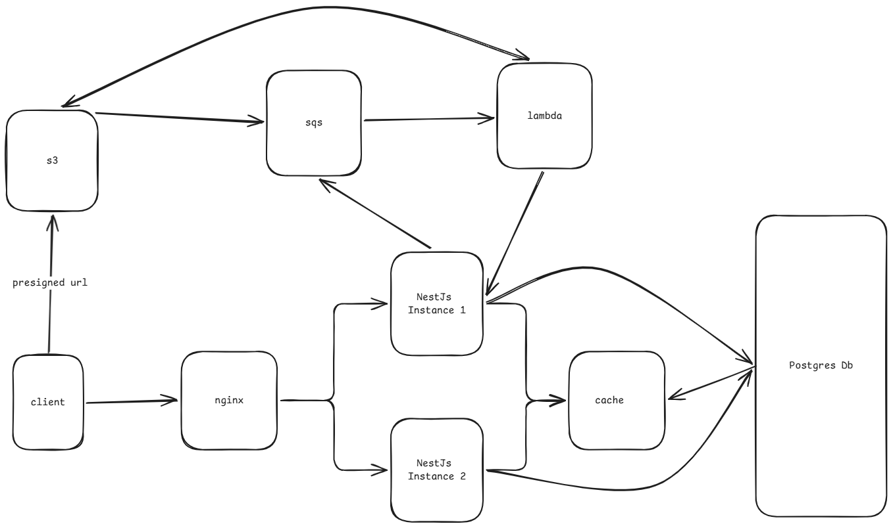

# Temp

## Description

This is a secure ephemeral file sharing application. It allows users to upload files and store them for a selected period of time and share public or passworded links to other people so they can access the file, provided the file is still available.

## Architecture



_Figure: High-level overview of the system components and their interactions. See docs/images for detailed flow diagrams._

## Features

- Secure file upload and storage
- Ephemeral file sharing with configurable expiration times
- Public and password-protected sharing options
- Real-time file access tracking
- Automated file cleanup based on expiration settings
- Malware scanning and detection

## Project Structure

```
temp/
├── src/                 # Application source code
├── prisma/              # Database schema and Prisma
├── ops/                 # Deployment configurations
├── docs/                # ADRs and Architecture diagrams
├── tests/               # E2E test files
├── scripts/             # CI/CD and deployment scripts
├── Dockerfile           # Docker configuration
├── prisma.config.ts     # Prisma configuration
└── README.md
```

## Project Setup

- Clone the repository

```bash
$ git clone https://github.com/shubomifashakin/Temp.git
```

- Install dependencies

```bash
$ npm install
```

- Configure environment variables

```bash
$ cp .env.example .env
```

- Spin up database and cache services

```bash
$ docker-compose up -d
```

- Run migrations

```bash
$ npx prisma migrate dev
```

- Start the development server

```bash
$ npm run start:dev
```

## Testing

```bash
# Run Unit Tests
$ npm run test

# Run E2E Tests
$ npm run test:e2e

```

## API Documentation

The API documentation is generated using Swagger/OpenAPI and is available at:

Local Development: http://localhost:3000/api/docs

The Swagger documentation is generated from code annotations, ensuring it stays in sync with the implementation. All endpoints, request/response DTOs, and authentication requirements are documented with examples and schemas.
